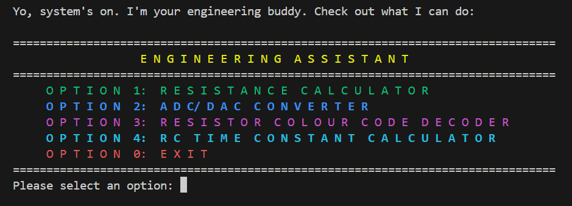

# 🤖 Engineering Assistant – ELEC2645 Module Project
This is your personal engineering buddy, a menu-driven C application that's got your back. It crushes all those tedious electronics calculations: resistance, RC time constants, resistor color code decoding, ADC/DAC conversions, and more.


This isn't your boring university calculator. It is built with a ["cool bro"](https://www.youtube.com/watch?v=dQw4w9WgXcQ&list=RDdQw4w9WgXcQ&start_radio=1) persona, complete with typewriter text effects, ASCII art, and error sounds to make number-crunching feel less like a chore.

Here's what you see when you fire it up:




## 📁 Project Structure
```
EngineeringAssistant/
│
├── main.c              # Entry point, launches main menu
├── menu.c              # Menu logic + navigation
├── rcalc.c             # Series/parallel resistor calculator
├── colour_code.c       # Resistor colour code decoder (4 and 5-band)
├── rc_time.c           # RC time constant calculator (charging/discharging)
├── adc_dac.c           # ADC/DAC converter
├── menu.h              # Menu system prototypes 
├── funcs.h             # 
│
└── README.md
```
## 🔥 Features
### 1. Resistor Calculator (Series/Parallel)
- Calculates total resistance for any number of resistors in Series (```R_total = R1 + R2 + ...```).

- Calculates total resistance for any number of resistors in Parallel (```1/R_total = 1/R1 + 1/R2 + ...```).

- Includes ASCII art diagrams for both circuit types.

### 2. ADC/DAC Converter:

- __ADC Mode:__ Converts an analog voltage (like from a sensor) into its digital (decimal and binary) equivalent based on your Vref and bit resolution.

- __DAC Mode:__ Converts a digital value back into its expected analog voltage.

### 3. Resistor Colour Code Decoder:

- Asks you for the 4 or 5 colors on a resistor and tells you the resistance and tolerance.

- Includes a full explanation of the color code system.

- Prints a cool color-coded preview of your resistor using ANSI terminal colors.

### 4. RC Time Constant Calculator:

- Calculates the voltage on a capacitor after a certain time (```t```).

- __Charging Mode:__ Calculates ```V(t)``` as the capacitor charges toward a supply voltage ```(Vcc)```.

- __Discharging Mode:__ Calculates ```V(t)``` as the capacitor discharges from an initial voltage ```(V0)```.

## ⚙️ Core Tech Features 
- __"Cool Bro" Persona:__ All prompts and error messages are written to be casual and fun.

- __Typewriter Effect__: All text is printed one character at a time using ```type_write()```.

- ___Robust Input Validation:__ This thing is built like a <span style="color:#ff1900ff">tank</span>. It uses custom ```get_int_input()``` and ```get_float_input()``` functions to catch and handle bad inputs (like ```abc``` instead of ```100``` or ```1.5``` when it expects ```2```). It won't crash (can't guarantee that actually 😁).

- __Modular Design:__ The project is cleanly separated into different ```.c``` and ```.h``` files for each feature (```rcalc.c```, ```adc_dac.c```, etc.), all managed by ```main.c```.


## 🛠️ Built With
- C (The one and only)

- __Windows.h API:__ Used for ```Sleep()``` (the typewriter effect) and ```Beep()``` (error sounds).


- __ANSI Escape Codes:__ For all the ```BOLD_GREEN```, ```BOLD_RED```, etc. colors in the terminal.

## 🚀 Getting Started
To get this running, you just need a C compiler (like ```gcc```).

### Prerequisites
Make sure you have gcc installed and added to your system's PATH. You can get it by installing [MinGW-w64](https://winlibs.com/#download-release "For Windows Users Only"). 

### Compilation
1. Open your terminal (PowerShell, Windows Terminal, or cmd).

2. Navigate to the project directory where all your .c files are.

3. Run the following command.

```gcc main.c menu.c rcalc.c adc_dac.c colour_code.c rc_time.c -o assistant.exe -lm```

4. This will create an ```assistant.exe``` file.

### Running
Just run the ```.exe``` from your terminal (```./assistant``` is all you need).

## 🧑🏻‍💻 Author

### Mortadha Rupani
#### ELEC2645 Embedded Systems Project
#### School of Electronic & Electrical Engineering
#### University of Leeds

---


